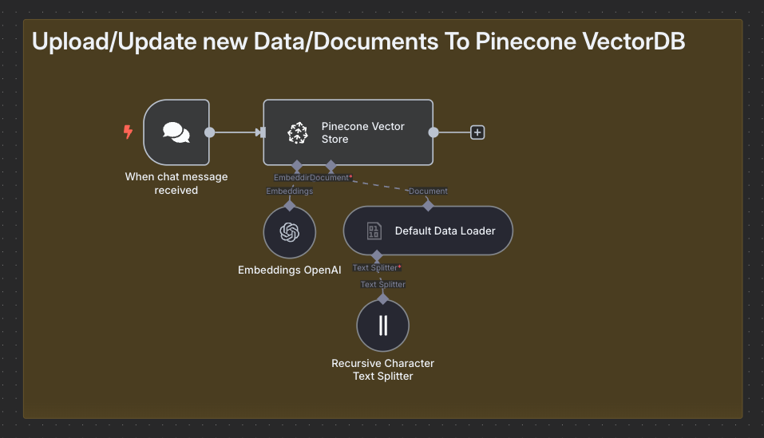
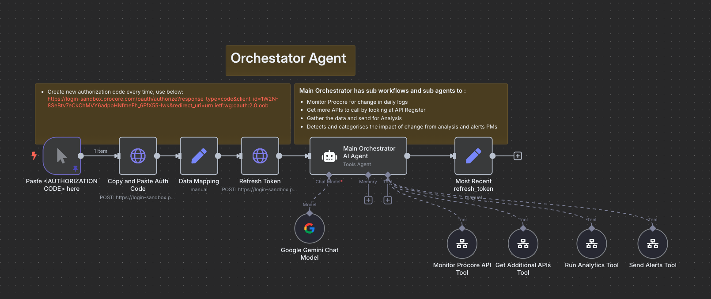
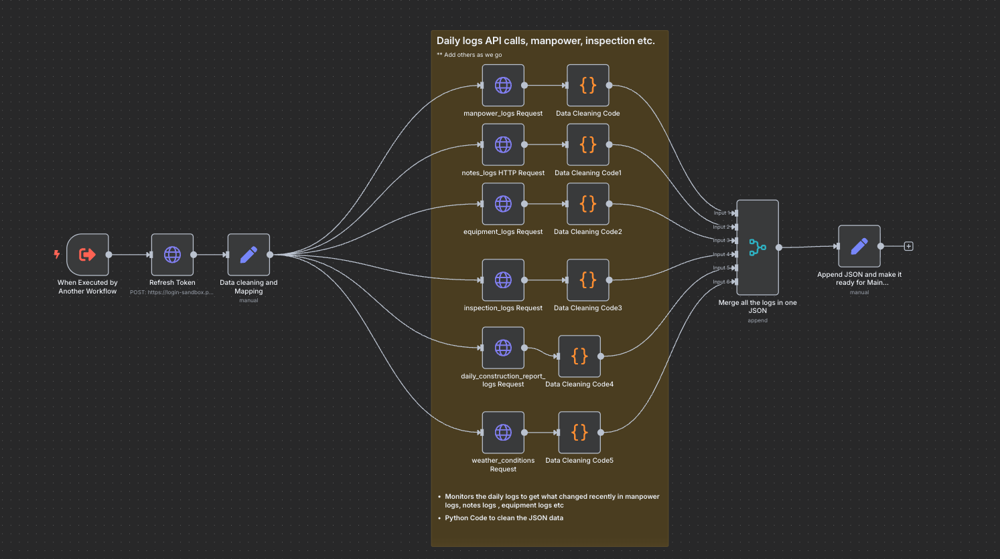
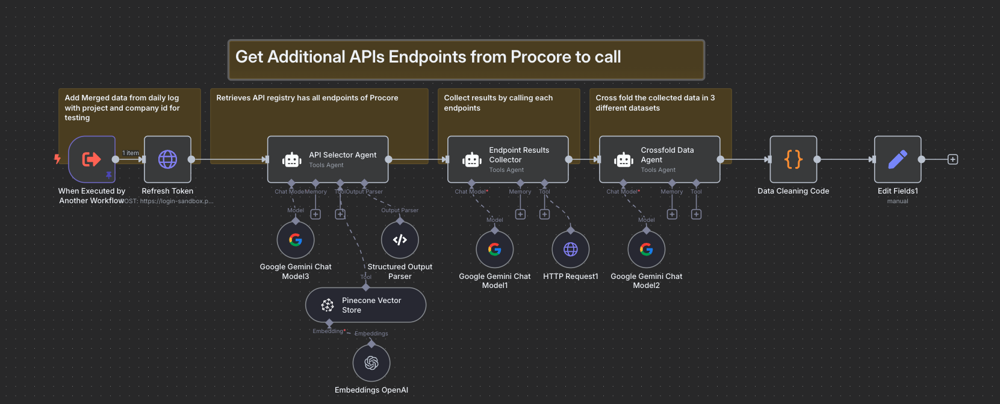
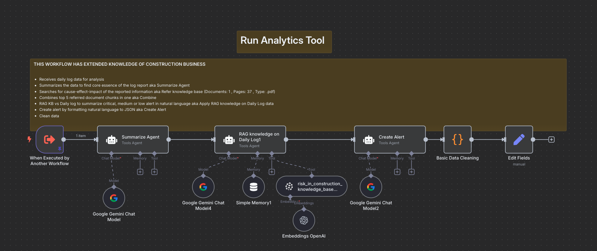
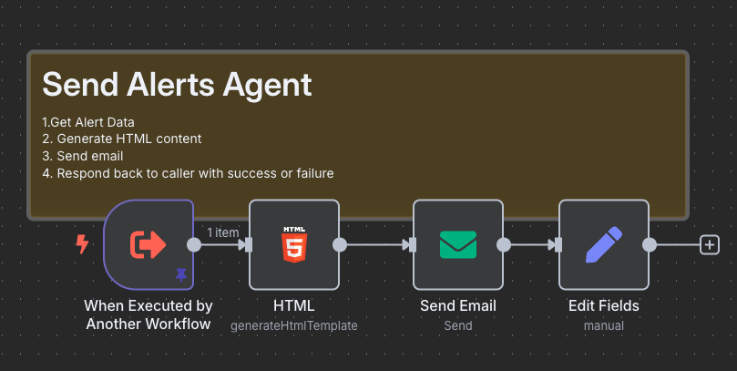
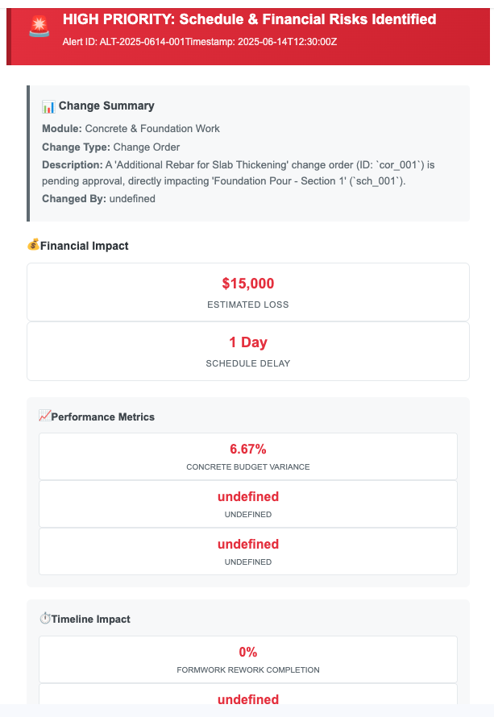

# Procore AI Alert System: Intelligent Construction Project Monitoring
## A Case Study in AI-Powered Risk Detection and Prevention

---

## Executive Summary

This case study presents an innovative AI-powered alerting system that transforms how Project Managers monitor construction projects using Procore. By combining intelligent daily log analysis with best practices knowledge base, the system proactively identifies schedule and financial risks, potentially preventing costly overruns and delays.

**Key Achievements:**
- 🤖 **AI-Driven Analysis**: Orchestrated agent system analyzing 6+ different Procore log types
- ⚡ **Rapid Response**: 6-7 minute end-to-end processing time
- 🎯 **Precision Alerts**: 150+ alerts generated during testing with specific financial impact estimates
- 📈 **Scalable Solution**: Designed for deployment across 150+ construction projects
- 🧠 **Knowledge-Based**: Vector database with construction best practices for contextual analysis

---

## Problem Statement

### The Challenge
Construction Project Managers face significant challenges in monitoring daily project activities:

- **Reactive Decision Making**: PMs often react to situations without consulting historical best practices, leading to cost overruns across multiple projects
- **Information Overload**: Manual review of multiple daily logs (manpower, equipment, inspection, weather, construction reports) is time-consuming and error-prone
- **Missed Risk Indicators**: Critical patterns and early warning signs buried in daily operational data
- **Knowledge Silos**: Best practices and lessons learned not readily accessible during decision-making moments
- **Delayed Response**: Issues identified after they've already impacted schedule and budget

### Business Impact
- Unplanned cost overruns due to reactive decision-making
- Schedule delays from missed early warning signs
- Inconsistent application of organizational best practices
- Reduced project profitability and client satisfaction

---

## Solution Architecture

### Overview
The solution implements an intelligent orchestrator agent system that continuously monitors Procore daily logs, analyzes them against a knowledge base of construction best practices, and generates proactive alerts with specific financial and schedule impact assessments.

### Core Components

#### 1. Knowledge Base (Pinecone Vector Database)

- **Purpose**: Centralized repository of construction best practices
- **Content**: 4-5 curated PDF documents including lessons learned and standard procedures
- **Technology**: Pinecone vector database for semantic search capabilities, RAG for grounded responses
- **Maintenance**: Implementation in place for adding future docs if agent performance indicates knowledge gaps

#### 2. Orchestrator Agent

- **Role**: Central intelligence coordinating all system components
- **Responsibilities**:
  - Procore API authentication and access management
  - Tool coordination and data flow management
  - Decision-making for additional API calls
  - Alert generation and distribution
- **Technology**:LLM (Gemini, used Ollama locally hosted for Dev)

#### 3. Specialized Tools

**Monitor Procore API Tool**

- Polls 6+ daily log types every 3 hours (configurable to event-driven)
- Log types monitored:
  - Manpower logs
  - Equipment logs  
  - Inspection logs
  - Daily construction reports
  - Weather condition logs
  - Field engineer notes
- Data cleaning and preprocessing using Python Code

**Get Additional API Tool**

- Semantic understanding of 380+ Procore APIs
- Uses OpenAPI specifications for intelligent endpoint selection
- Dynamic API calling based on context analysis
- Data aggregation and cleaning using Python 

**Run Analytics Tool**

- Daily log data summarization
- Cause, effect, and impact analysis
- Knowledge base consultation for best practices
- Risk assessment and quantification
- Alert generation with specific metrics

**Send Alert Tool**

- Email-based alert distribution
- Rich formatting with actionable insights

---

## Implementation Journey

### Development Timeline
**Total Duration**: 3 months

**Phase 1 (Month 1)**: Foundation
- Construction best practices documentation research
- Procore API exploration and documentation
- Architecture design and tool selection

**Phase 2 (Month 2)**: Core Development
- Agent framework development and testing
- Pinecone vector database setup and population
- Initial API integrations

**Phase 3 (Month 3)**: Integration & Testing
- End-to-end workflow implementation
- Synthetic data testing on Procore sandbox
- Alert system refinement and optimization

### Technical Challenges Overcome

1. **Best Practices Documentation**
   - Challenge: Creating comprehensive, machine-readable documentation
   - Solution: Systematic conversion of tribal knowledge into structured formats

2. **Agent Development Learning Curve**
   - Challenge: First-time implementation of multi-agent systems
   - Solution: Iterative development with extensive testing frameworks

3. **API Integration Complexity**
   - Challenge: Managing 380+ Procore API endpoints intelligently
   - Solution: Semantic API selection using OpenAPI specifications

4. **Real-time Processing**
   - Challenge: Balancing thoroughness with response time
   - Solution: Optimized workflow achieving 6-7 minute processing cycles

---

## Results & Impact

### Quantitative Results

**System Performance:**
- **Processing Speed**: 6-7 minutes from log update to alert delivery
- **Alert Volume**: 150+ alerts generated during testing phase
- **API Coverage**: Intelligent selection from 380+ available Procore APIs
- **Polling Frequency**: Every 3 hours (adaptable to event-driven)

**Alert Examples:**
- **Financial Risk Detection**: $15,000 estimated loss identification
- **Schedule Impact**: 1-day delay early warning
- **Performance Metrics**: 6.67% concrete budget variance alerts
- **Change Management**: Proactive change order impact analysis

### Qualitative Benefits

**For Project Managers:**
- Proactive rather than reactive project management
- Access to organizational best practices at decision points
- Specific, actionable insights with quantified impacts
- Reduced manual log review time

**For Organizations:**
- Standardized application of best practices across projects
- Early risk detection and mitigation
- Improved project predictability and control
- Enhanced learning from historical data

---

## Technical Innovation

### AI-Powered Decision Making
- **Multi-Agent Architecture**: Specialized tools coordinated by intelligent orchestrator
- **Semantic API Selection**: Context-aware selection from 380+ available endpoints
- **Vector-Based Knowledge Retrieval**: Pinecone database for relevant best practice matching
- **Local LLM Deployment**: Anthropic Claude and Ollama for data privacy and control

### Scalable Design
- **Event-Driven Capability**: Adaptable from scheduled to real-time processing
- **Modular Architecture**: Easy addition of new tools and capabilities
- **Knowledge Base Evolution**: Dynamic learning from performance feedback
- **Multi-Project Deployment**: Designed for 150+ project rollout

### Integration Patterns
- **API-First Approach**: Seamless integration with existing Procore workflows
- **Webhook Ready**: Prepared for real-time event processing
- **Email Integration**: Familiar alert delivery mechanism for user adoption

---

## Use Case Example

### Scenario: Foundation Work Schedule Risk

**Trigger**: Field engineer logs equipment delay and weather concerns in daily report

**Analysis Process**:
1. **Data Collection**: Monitor tool detects new log entries
2. **Context Gathering**: Additional API tool pulls related schedule, budget, and resource data
3. **Risk Assessment**: Analytics tool consults knowledge base for similar scenarios
4. **Impact Calculation**: System estimates $15,000 potential loss and 1-day schedule delay
5. **Alert Generation**: Detailed alert sent to PM with specific recommendations

**Alert Content**:
- **Priority Level**: HIGH - Schedule & Financial Risks Identified
- **Specific Impact**: $15,000 estimated loss, 1-day schedule delay
- **Root Cause**: Change order pending approval affecting foundation pour
- **Recommended Actions**: Expedite approval process, consider alternatives
- **Supporting Data**: Performance metrics showing 6.67% budget variance

---

## Lessons Learned

### What Worked Well
- **Knowledge Base Approach**: Vector database effectively matched current situations with historical best practices
- **Multi-Agent Architecture**: Specialized tools provided better performance than monolithic solutions
- **Local LLM Deployment**: Enhanced data privacy and reduced external dependencies
- **Synthetic Data Testing**: Procore sandbox environment enabled comprehensive testing

### Challenges Encountered
- **Documentation Quality**: Initial best practices required multiple refinement iterations
- **Agent Coordination**: Complex multi-tool workflows needed careful orchestration logic
- **API Rate Limiting**: Intelligent API selection became crucial for performance
- **Knowledge Base Maintenance**: Continuous improvement process required systematic approach

### Best Practices Discovered
1. **Start with Quality Documentation**: Invest heavily in comprehensive best practices documentation
2. **Iterative Agent Development**: Build and test individual tools before integration
3. **Sandbox Testing**: Use synthetic data extensively before production deployment
4. **Performance Monitoring**: Implement feedback loops to identify knowledge gaps
5. **User-Centric Alerts**: Focus on actionable insights rather than raw data

---

## Future Roadmap

### Short-Term Enhancements (3-6 months)
- **Real-Time Processing**: Migration from scheduled to event-driven architecture
- **Mobile Alerts**: Push notifications for critical alerts
- **Dashboard Integration**: Visual analytics within Procore interface
- **Alert Feedback Loop**: User feedback system for continuous learning

### Medium-Term Expansion (6-12 months)
- **Additional Modules**: Safety, quality, and compliance monitoring
- **Predictive Analytics**: Trend analysis for proactive risk identification
- **Integration Expansion**: Connection with other construction management tools
- **Multi-Language Support**: International project deployment capability

### Long-Term Vision (1+ years)
- **Machine Learning Integration**: Pattern recognition for unique project characteristics
- **Industry Benchmarking**: Comparative analysis across similar projects
- **Automated Responses**: System-initiated corrective actions for routine issues
- **Knowledge Marketplace**: Sharing best practices across organizations

---

## Technical Specifications

### System Requirements
- **Processing Environment**: Local deployment with cloud backup
- **LLM Models**: Anthropic Claude + Ollama for redundancy
- **Vector Database**: Pinecone for knowledge base storage
- **Integration Platform**: n8n for workflow orchestration
- **API Management**: Procore OAuth 2.0 authentication

### Performance Characteristics
- **Response Time**: 6-7 minutes end-to-end processing
- **Throughput**: Multiple project monitoring simultaneously
- **Availability**: 99%+ uptime with local deployment
- **Scalability**: Designed for 150+ concurrent projects

---

## Conclusion

This AI-powered Procore alerting system represents a significant advancement in construction project management, transforming reactive problem-solving into proactive risk prevention. By combining intelligent daily log analysis with organizational knowledge, the system enables Project Managers to make informed decisions backed by historical best practices.

The 3-month development investment has created a scalable solution ready for deployment across 150+ projects, with the potential to prevent significant cost overruns and schedule delays. The modular, AI-driven architecture provides a foundation for continued innovation in construction technology.

### Key Takeaways for Industry
1. **AI Integration**: Modern construction benefits from intelligent automation of routine monitoring tasks
2. **Knowledge Preservation**: Vector databases effectively capture and apply organizational learning
3. **Proactive Management**: Early warning systems significantly outperform reactive approaches
4. **Local AI Deployment**: Data privacy and control requirements favor on-premises LLM solutions
5. **User-Centric Design**: Success depends on delivering actionable insights, not just data

---

## About This Implementation

**Development Context**: Proof of Concept for data center construction projects
**Technology Stack**: n8n, Anthropic Claude, Ollama, Pinecone, Procore APIs , POSTMAN
**Testing Environment**: Procore sandbox with synthetic data simulation
**Industry Focus**: Data center construction (applicable to all construction types)

*This case study demonstrates practical AI application in construction management, showing how modern technology can enhance traditional project management practices while preserving human decision-making authority.*
